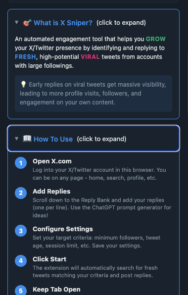
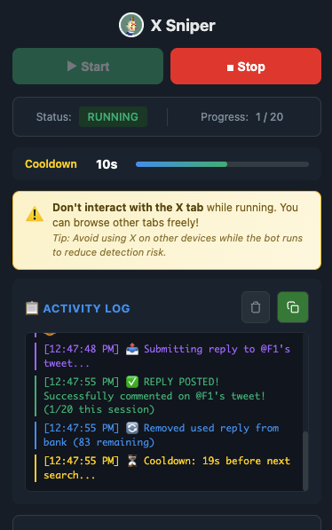
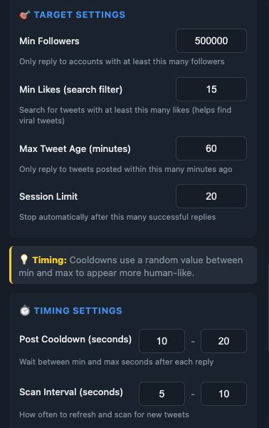
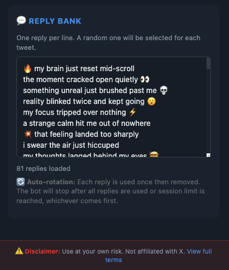
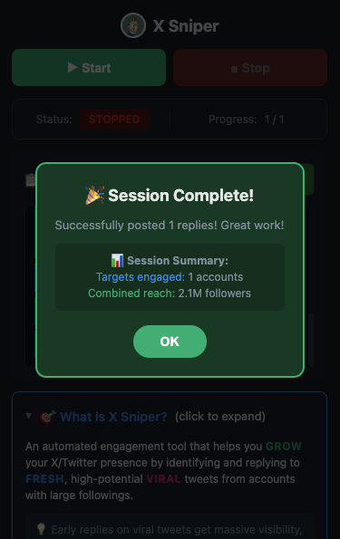
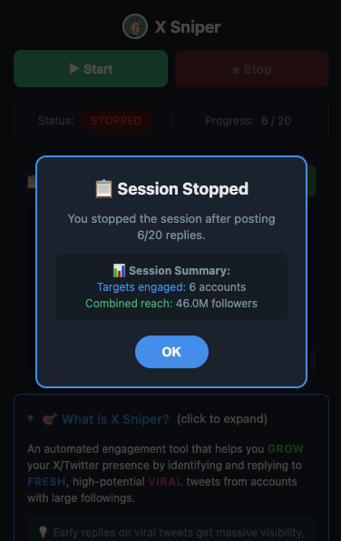
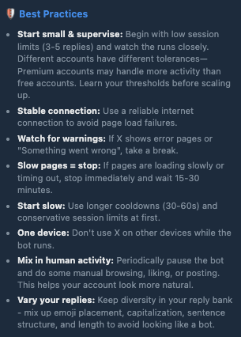

# X Sniper 🎯

A Chrome extension that helps you engage with fresh, high-visibility tweets on X/Twitter. Target tweets from accounts with large followings and automatically post replies from your custom reply bank.


## Screenshots

<p align="center">
  
  
</p>

<p align="center">
  
  
</p>

<p align="center">
  
  
</p>

<p align="center">
  
</p>

## ⚠️ Disclaimer

This tool is for **educational purposes only**. Automated engagement may violate X/Twitter's Terms of Service. Use at your own risk. The developers are not responsible for any account restrictions or bans resulting from use of this extension.

## Features

- 🎯 **Smart Targeting** - Filter by minimum followers, likes, and tweet freshness
- 📝 **Reply Bank** - Rotate through your custom replies automatically
- ⏱️ **Humanized Timing** - Random delays between actions to appear natural
- 📊 **Session Tracking** - Set limits and view session summaries
- 🛡️ **Safety Features** - Auto-pause on errors, rate limit detection
- 💾 **Persistent Settings** - Your config saves across sessions

## Installation

1. **Download** this repository (Code → Download ZIP) or clone it:
   ```bash
   git clone https://github.com/point-onefive/x-sniper-extension.git
   ```

2. **Open Chrome** and navigate to `chrome://extensions/`

3. **Enable Developer Mode** (toggle in top right)

4. **Click "Load unpacked"** and select the downloaded folder

5. **Pin the extension** to your toolbar for easy access

## Quick Start

1. Log into X/Twitter in Chrome
2. Click the X Sniper extension icon
3. Accept the Terms & Conditions
4. Configure your target settings:
   - **Min Followers**: Only engage with accounts above this threshold
   - **Min Likes**: Only target tweets with this many likes
   - **Max Tweet Age**: How fresh the tweets should be (in minutes)
   - **Session Limit**: How many replies per session
5. Add replies to your Reply Bank (one per line)
6. Click **Save Settings**
7. Click **Start** to begin

## Best Practices

⚠️ **Read these carefully to protect your account:**

- **Start small & supervise** - Begin with 3-5 reply sessions and watch closely
- **Use longer cooldowns** - 30-60 seconds minimum between replies
- **Don't walk away** - Monitor your first several sessions
- **Vary your replies** - Use diverse wording, emojis, and formats
- **Take breaks** - Mix in manual activity between automated sessions
- **Watch for warnings** - Stop immediately if X shows errors
- **One device** - Don't use X elsewhere while running

## Settings Guide

| Setting | Description | Conservative Default |
|---------|-------------|---------------------|
| Min Followers | Target accounts with at least this many followers | 1,000,000 |
| Min Likes | Only reply to tweets with this many likes | 20 |
| Max Tweet Age | Maximum age of tweets in minutes | 1 |
| Session Limit | Replies before auto-stop | 5 |
| Cooldown | Seconds between replies | 30-60 |
| Scan Interval | Seconds between searches | 15-30 |

## How It Works

1. Extension opens X search with your criteria
2. Scans for fresh tweets matching your filters
3. Checks author's follower count
4. Posts a random reply from your bank
5. Waits for cooldown, then repeats
6. Stops when session limit is reached

## Troubleshooting

**Extension not finding tweets?**
- Lower your min followers/likes thresholds
- Increase max tweet age
- Make sure you're logged into X

**Getting rate limited?**
- Increase cooldown times
- Reduce session limits
- Take longer breaks between sessions

**Replies not posting?**
- Check your internet connection
- Make sure the X tab stays open and visible
- Don't interact with the tab while running

## File Structure

```
x-sniper-extension/
├── manifest.json    # Extension configuration
├── background.js    # Main orchestration logic
├── content.js       # DOM interaction on X pages
├── popup.html       # Settings UI
├── popup.js         # UI logic
├── styles.css       # Styling
└── icons/           # Extension icons
```

## Contributing

Pull requests welcome! Please test thoroughly before submitting.

## License

MIT License - See LICENSE file for details.

---

**Remember:** Use responsibly. Your account, your responsibility.
